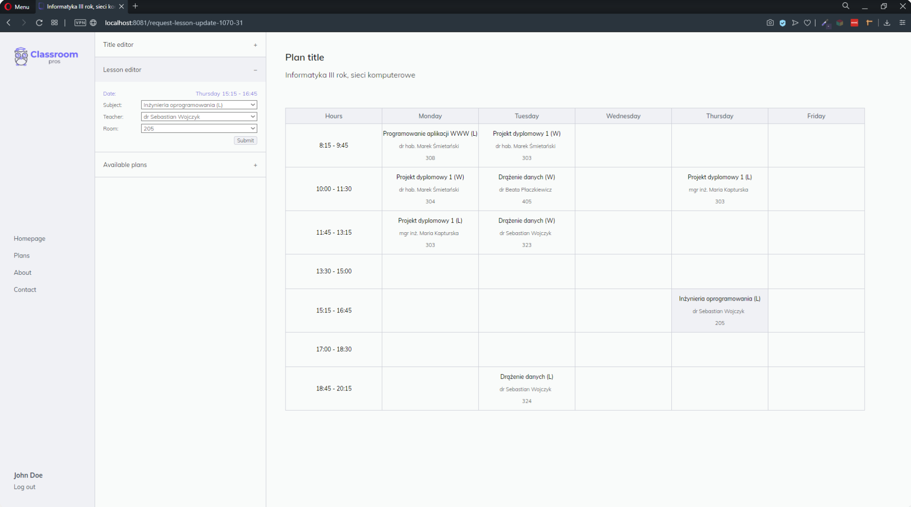

<a name="readme-top"></a>


<!-- PROJECT LOGO -->
<br />
<div align="center">
  
  <h3 align="center">Classrom-Pros</h3>
  <p align="center">
    A web-based tool for creating and managing
    <br>lesson plans with export functionality, built using 
    <br>Spring Boot, JPA, Thymeleaf, and MySQL.
    <br /><br />
  </p>
</div>


<!-- TABLE OF CONTENTS -->
<details>
  <summary>Table of Contents</summary>
  <ol>
    <li>
      <a href="#about-the-project">About The Project</a>
      <ul>
        <li><a href="#built-with">Built With</a></li>
      </ul>
    </li>
    <li>
      <a href="#getting-started">Getting Started</a>
      <ul>
        <li><a href="#installation">Installation</a></li>
      </ul>
    </li>
    <li><a href="#usage">Usage</a></li>
    <li><a href="#license">License</a></li>
    <li><a href="#contact">Contact</a></li>
    <li><a href="#acknowledgments">Acknowledgments</a></li>
  </ol>
</details>


<!-- ABOUT THE PROJECT -->
## About The Project

This repository contains a web-based tool for creating, editing, and managing lesson plans that can be easily shared with others. The tool allows teachers to create plans using dynamic tables, and then export them as PDFs. Students can view their plans, but only teachers have permission to edit them using their accounts.

This project was created during computer engineering studies as a task for learning purposes. It uses a variety of technologies, including Spring Boot, Spring Data JPA, Thymeleaf, and MySQL.

<p align="right">(<a href="#readme-top">back to top</a>)</p>


### Built With

![Java][Java-url]
![Spring][Spring-url]
![Thymeleaf][Thymeleaf-url]
![MySQL][MySQL-url]

<p align="right">(<a href="#readme-top">back to top</a>)</p>


<!-- GETTING STARTED -->
## Getting Started

To get a local copy up and running follow these simple steps.

### Installation

1. Clone the repo
   ```sh
   git clone git@github.com:kamillobinski/classroom-pros.git
   ```

2. Update database variables in the application.yml
   ```yaml
    url: jdbc:mysql://HOST:PORT/DB
    username: DB_USERNAME
    password: DB_PASSWORD
   ```

3. Run the command to start the Spring Boot application (make sure you have Java and Maven installed on your system)
   ```sh
   mvn spring-boot:run
   ```

4. Once the application is running, open your web browser and navigate to `http://localhost:8081` to access the application.

<p align="right">(<a href="#readme-top">back to top</a>)</p>


<!-- USAGE -->
## Usage



<p align="right">(<a href="#readme-top">back to top</a>)</p>


<!-- LICENSE -->
## License

Distributed under the MIT License. See `LICENSE` for more information.

<p align="right">(<a href="#readme-top">back to top</a>)</p>


<!-- CONTACT -->
## Contributors

<div>
    <a href="https://github.com/kamillobinski/classroom-pros/graphs/contributors">
      
    </a>
</div>

<p align="right">(<a href="#readme-top">back to top</a>)</p>


<!-- MARKDOWN LINKS & IMAGES -->
[Java-url]: https://img.shields.io/badge/java-%23ED8B00.svg?style=for-the-badge&logo=java&logoColor=white
[Spring-url]: https://img.shields.io/badge/spring-%236DB33F.svg?style=for-the-badge&logo=spring&logoColor=white
[Thymeleaf-url]: https://img.shields.io/badge/Thymeleaf-%23005C0F.svg?style=for-the-badge&logo=Thymeleaf&logoColor=white
[MySQL-url]: https://img.shields.io/badge/mysql-%2300f.svg?style=for-the-badge&logo=mysql&logoColor=white